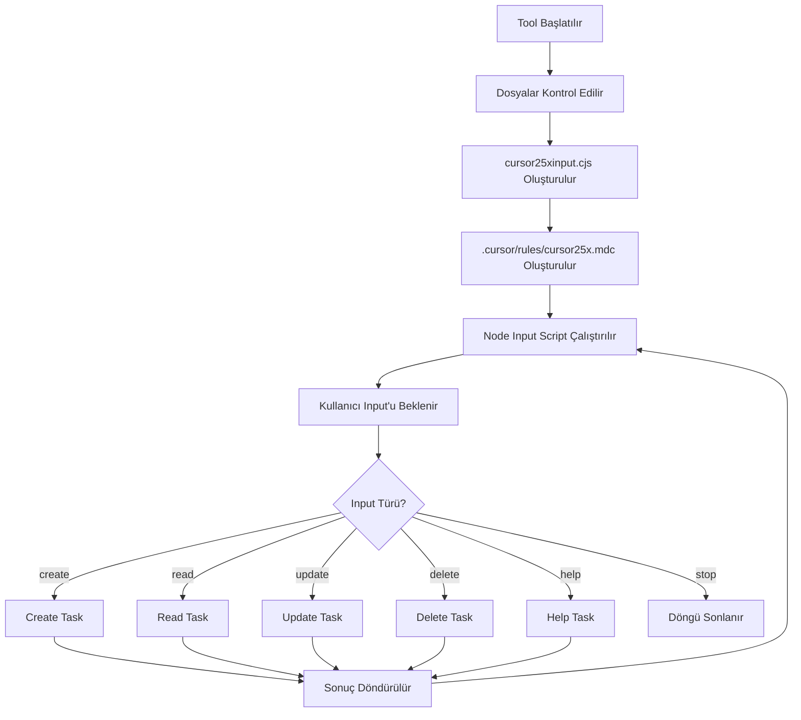

# CURSOR25X - Interactive Task Loop MCP Server

🚀 **CURSOR25X**, Cursor IDE için geliştirilmiş interactive task loop MCP (Model Context Protocol) server'ıdır. Kullanıcıdan sürekli input alarak task-based işlemleri gerçekleştirir ve modern web uygulamaları geliştirir.

## 🎯 Özellikler

- 🔄 **Interactive Task Loop**: Sürekli kullanıcı girdisi ile task döngüsü
- 📝 **Automatic File Management**: `cursor25xinput.cjs` dosyasını otomatik oluşturur
- 🌐 **Web App Ready**: Modern web uygulamaları için hazır
- 📁 **Smart Working Directory**: Cursor workspace'ini otomatik algılar
- 🛑 **Graceful Exit**: "stop" komutu ile temiz çıkış
- ⚡ **Task Processing**: Girdi türüne göre uygun task belirleme
- 📋 **Cursor Rules Integration**: `.cursor/rules/cursor25x.mdc` kuralları

## 🚀 Hızlı Kurulum

### 1. Repository'yi Clone Edin
```bash
git clone https://github.com/tuncer-byte/cursor25x.git
cd cursor25x
```

### 2. Bağımlılıkları Yükleyin
```bash
npm install
npm run build
```

### 3. Cursor IDE'ye Entegre Edin

`~/.cursor/mcp.json` dosyasına aşağıdakini ekleyin:

```json
{
  "mcpServers": {
    "cursor25x": {
      "command": "node",
      "args": ["/path/to/cursor25x/dist/index.js"]
    }
  }
}
```

### 4. Kullanıma Başlayın

Cursor IDE'de:
1. Ctrl+Shift+P > "MCP: Connect to Server"
2. `cursor25x` server'ını seçin
3. `start_task_loop` tool'unu çalıştırın

## 🔧 Kullanım

### Ana Tool: `start_task_loop`

**Tek tool, maksimum güç!** 

```javascript
// Cursor IDE'de bu tool'u çalıştırın:
mcp_cursor25x_start_task_loop()
```

**Ne Yapar:**
- 🔄 Interactive döngü başlatır
- 📝 `cursor25xinput.cjs` oluşturur
- 📋 `.cursor/rules/cursor25x.mdc` kural dosyası oluşturur
- 🖥️ Terminal'de kullanıcı input'u bekler
- ⚡ Input'a göre task işler

## 📊 Task Loop Workflow



## 💡 Örnek Kullanım Komutları

### Web Uygulaması Oluşturma
```bash
🚀 CURSOR25X prompt: create a modern React web app with authentication
```

### Kod İnceleme
```bash
🚀 CURSOR25X prompt: read and analyze the current project structure
```

### Güncelleme
```bash
🚀 CURSOR25X prompt: update the package.json with latest dependencies
```

### Yardım
```bash
🚀 CURSOR25X prompt: help
```

### Döngüyü Sonlandırma
```bash
🚀 CURSOR25X prompt: stop
```

## 🏗️ Proje Yapısı

```
cursor25x/
├── src/
│   ├── index.ts              # Ana MCP server
│   ├── interactive-loop.ts   # Task loop logic
│   ├── input-handler.ts      # Input processing
│   └── rules.ts             # Task kuralları
├── dist/                    # Compiled JavaScript
├── .cursor/
│   └── rules/
│       └── cursor25x.mdc    # Cursor IDE kuralları
├── cursor25xinput.cjs       # Interactive input handler
├── package.json
├── tsconfig.json
└── README.md
```

## 🛠️ Geliştirme

### Development Modunda Çalıştırma
```bash
npm run dev
```

### Build
```bash
npm run build
```

### Test Etme
```bash
# MCP server'ı test et
node dist/index.js
```

## 🔧 Konfigürasyon

### Working Directory
Server otomatik olarak şu sırada working directory belirler:
1. `CURSOR_WORKSPACE` environment variable
2. `PWD` environment variable  
3. `~/cursor25x` default directory

### Cursor Rules
`.cursor/rules/cursor25x.mdc` dosyası otomatik oluşturulur ve şunları içerir:
- Task loop workflow kuralları
- Input processing rehberi
- Error handling direktifleri
- Kullanım örnekleri

## 🌐 Web App Desteği

CURSOR25X, modern web uygulaması geliştirme için optimize edilmiştir:

- **React/Vue/Angular** projeleri
- **Node.js** backend geliştirme  
- **Database** entegrasyonu
- **API** geliştirme
- **Authentication** sistemleri
- **Modern UI/UX** tasarım

## 🚨 Troubleshooting

### MCP Connection Hatası
```bash
# Server'ın çalıştığını kontrol edin
ps aux | grep cursor25x

# Port kontrolü
netstat -an | grep LISTEN
```

### Build Hatası
```bash
# Dependencies'i temizle ve yeniden yükle
rm -rf node_modules package-lock.json
npm install
npm run build
```

### Cursor Integration Hatası
1. `~/.cursor/mcp.json` dosyasını kontrol edin
2. Path'lerin doğru olduğundan emin olun
3. Cursor IDE'yi yeniden başlatın

## 🤝 Katkıda Bulunma

1. Fork edin
2. Feature branch oluşturun (`git checkout -b feature/amazing-feature`)
3. Commit edin (`git commit -m 'Add amazing feature'`)
4. Push edin (`git push origin feature/amazing-feature`)
5. Pull Request oluşturun

## 📝 Lisans

MIT License - detaylar için [LICENSE](LICENSE) dosyasını inceleyin.

## 🎉 Credits

- **Geliştirici**: [tuncer-byte](https://github.com/tuncer-byte)
- **MCP SDK**: [@modelcontextprotocol/sdk](https://github.com/modelcontextprotocol/sdk)
- **Cursor IDE**: [Cursor](https://cursor.sh/)

## 📞 İletişim

- **GitHub Issues**: [Issues](https://github.com/tuncer-byte/cursor25x/issues)
- **Discussions**: [Discussions](https://github.com/tuncer-byte/cursor25x/discussions)

---

🚀 **CURSOR25X ile development workflow'unuzu 25x hızlandırın!**

*Modern AI-powered development için tasarlandı. Cursor IDE ile mükemmel uyum.* 