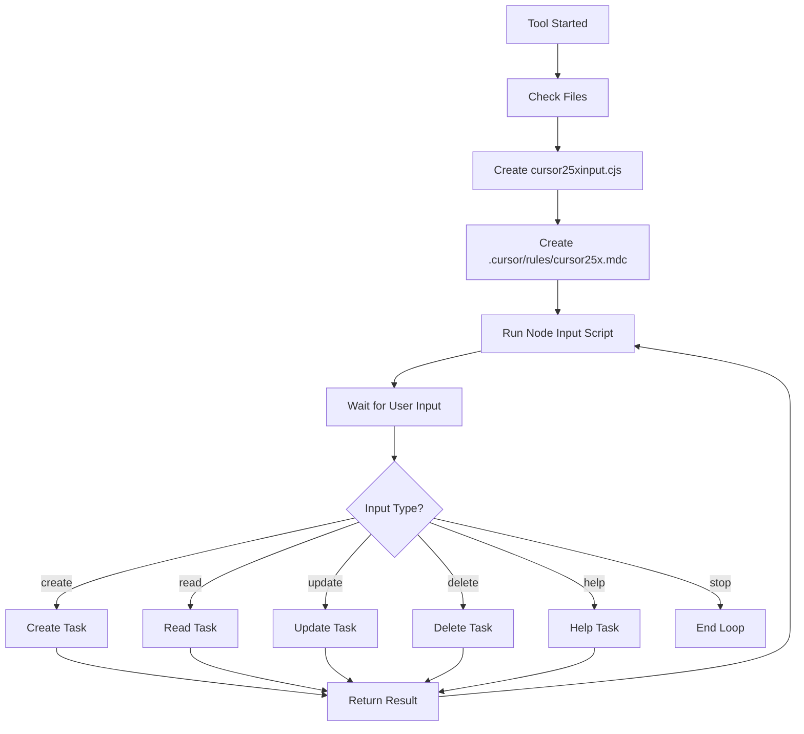

# CURSOR25X - Interactive Task Loop MCP Server


## 📱 Social Media

[](https://youtube.com/@tuncerbyte)
[](https://linkedin.com/in/tuncer-bagcabasi)
[](https://instagram.com/tuncer_byte)

🚀 **CURSOR25X** is an interactive task loop MCP (Model Context Protocol) server developed for Cursor IDE. It performs task-based operations by continuously receiving user input and develops modern web applications.

## 🎯 Features

- 🔄 **Interactive Task Loop**: Continuous task loop with user input
- 📝 **Automatic File Management**: Automatically creates `cursor25xinput.cjs` file
- 🌐 **Web App Ready**: Ready for modern web applications
- 📁 **Smart Working Directory**: Automatically detects Cursor workspace
- 🛑 **Graceful Exit**: Clean exit with "stop" command
- ⚡ **Task Processing**: Determines appropriate tasks based on input type
- 📋 **Cursor Rules Integration**: `.cursor/rules/cursor25x.mdc` rules

## 🚀 Quick Setup

### 1. Clone Repository
```bash
git clone https://github.com/tuncer-byte/cursor25x.git
cd cursor25x
```

### 2. Install Dependencies
```bash
npm install
npm run build
```

### 3. Integrate with Cursor IDE

Add the following to your `~/.cursor/mcp.json` file:

```json
{
  "mcpServers": {
    "cursor25x": {
      "command": "node",
      "args": ["/path/to/cursor25x/dist/index.js"]
    }
  }
}
```

### 4. Start Using

In Cursor IDE:
1. Ctrl+Shift+P > "MCP: Connect to Server"
2. Select `cursor25x` server
3. Run `start_task_loop` tool

## 🔧 Usage

### Main Tool: `start_task_loop`

**One tool, maximum power!** 

```javascript
// Run this tool in Cursor IDE:
mcp_cursor25x_start_task_loop()
```

**What it does:**
- 🔄 Starts interactive loop
- 📝 Creates `cursor25xinput.cjs`
- 📋 Creates `.cursor/rules/cursor25x.mdc` rules file
- 🖥️ Waits for user input in terminal
- ⚡ Processes tasks based on input

## 📊 Task Loop Workflow



## 💡 Example Usage Commands

### Create Web Application
```bash
🚀 CURSOR25X prompt: create a modern React web app with authentication
```

### Code Review
```bash
🚀 CURSOR25X prompt: read and analyze the current project structure
```

### Update
```bash
🚀 CURSOR25X prompt: update the package.json with latest dependencies
```

### Help
```bash
🚀 CURSOR25X prompt: help
```

### End Loop
```bash
🚀 CURSOR25X prompt: stop
```

## 🏗️ Project Structure

```
cursor25x/
├── src/
│   ├── index.ts              # Main MCP server
│   ├── interactive-loop.ts   # Task loop logic
│   ├── input-handler.ts      # Input processing
│   └── rules.ts             # Task rules
├── dist/                    # Compiled JavaScript
├── .cursor/
│   └── rules/
│       └── cursor25x.mdc    # Cursor IDE rules
├── cursor25xinput.cjs       # Interactive input handler
├── package.json
├── tsconfig.json
└── README.md
```

## 🛠️ Development

### Run in Development Mode
```bash
npm run dev
```

### Build
```bash
npm run build
```

### Testing
```bash
# Test MCP server
node dist/index.js
```

## 🔧 Configuration

### Working Directory
Server automatically determines working directory in this order:
1. `CURSOR_WORKSPACE` environment variable
2. `PWD` environment variable  
3. `~/cursor25x` default directory

### Cursor Rules
`.cursor/rules/cursor25x.mdc` file is automatically created and includes:
- Task loop workflow rules
- Input processing guide
- Error handling directives
- Usage examples

## 🌐 Web App Support

CURSOR25X is optimized for modern web application development:

- **React/Vue/Angular** projects
- **Node.js** backend development  
- **Database** integration
- **API** development
- **Authentication** systems
- **Modern UI/UX** design

## 🚨 Troubleshooting

### MCP Connection Error
```bash
# Check if server is running
ps aux | grep cursor25x

# Port check
netstat -an | grep LISTEN
```

### Build Error
```bash
# Clean dependencies and reinstall
rm -rf node_modules package-lock.json
npm install
npm run build
```

### Cursor Integration Error
1. Check `~/.cursor/mcp.json` file
2. Make sure paths are correct
3. Restart Cursor IDE

## 🤝 Contributing

1. Fork the project
2. Create feature branch (`git checkout -b feature/amazing-feature`)
3. Commit changes (`git commit -m 'Add amazing feature'`)
4. Push to branch (`git push origin feature/amazing-feature`)
5. Create Pull Request

## 📝 License

MIT License - see [LICENSE](LICENSE) file for details.

## 🎉 Credits

- **Developer**: [tuncer-byte](https://github.com/tuncer-byte)
- **MCP SDK**: [@modelcontextprotocol/sdk](https://github.com/modelcontextprotocol/sdk)
- **Cursor IDE**: [Cursor](https://cursor.sh/)

## 📞 Contact

- **GitHub Issues**: [Issues](https://github.com/tuncer-byte/cursor25x/issues)
- **Discussions**: [Discussions](https://github.com/tuncer-byte/cursor25x/discussions)

---

🚀 **Speed up your development workflow 25x with CURSOR25X!**

*Designed for modern AI-powered development. Perfect harmony with Cursor IDE.* 